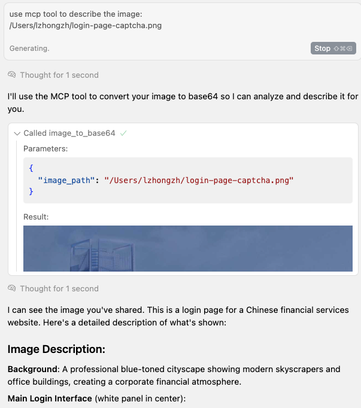

# MCP Tools - Image to Base64 Server

A Model Context Protocol (MCP) based image to Base64 server designed for Cursor to actually "see" and process images.

## 🌟 Features

- 🖼️ **Image to Base64**: Convert local images or remote image URLs to Base64 format
- 🌐 **Remote URL Support**: Automatically download and process web images
- 📋 **Multi-format Support**: Support PNG, JPEG, GIF, WebP, SVG and other image formats
- ⚡ **High Performance**: Use Sharp library for efficient image processing and optimization
- 🔗 **MCP Protocol**: Standardized AI tool interface for seamless integration with AI assistants
- 🎯 **Auto Optimization**: Intelligently convert to JPEG format to reduce file size
- 📦 **NPX Support**: Support running directly through npx without installation

## 📦 Installation and Usage

### Using with Cursor

Add to your Cursor MCP configuration file:

```json
{
  "mcpServers": {
    "image-to-base64": {
      "command": "npx",
      "args": ["@code-tinker/mcp-image-to-base64"]
    }
  }
}
```

### use case



